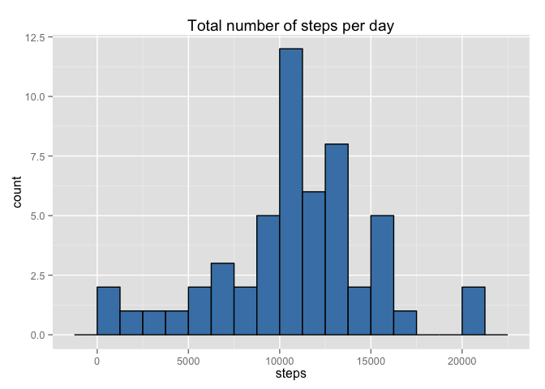
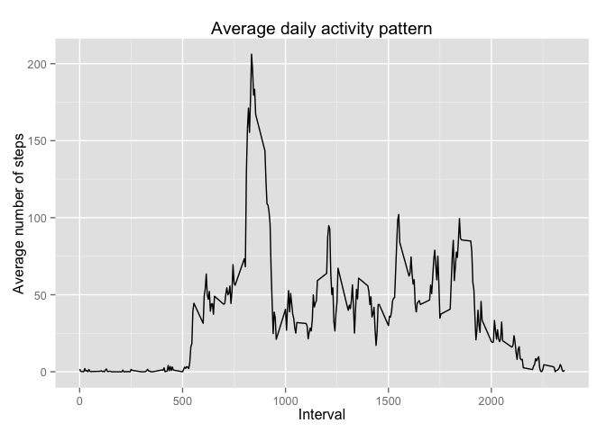
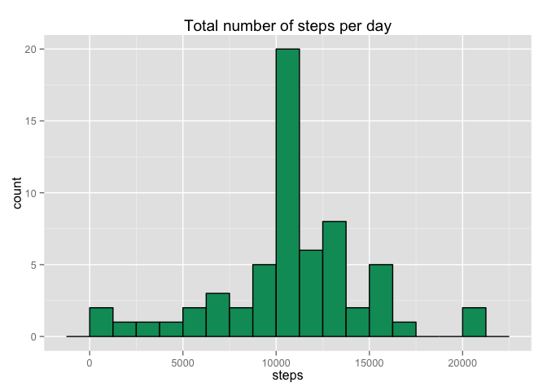
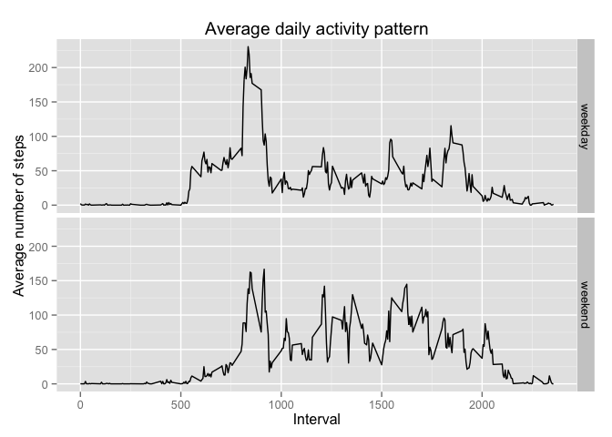

# Reproducible Research: Peer Assessment 1


## Loading and preprocessing the data

The data contained in the activity file are read into R and stored in a data frame:
*dt*


```r
dt <- read.csv("activity.csv")
```

It contains 17568 observations of three variables: 

- steps

- date

- interval

## What is mean total number of steps taken per day?

The total steps taken each day are calculated and shown in a histogram.


```r
dt2 <- aggregate(. ~ date, data=dt, FUN=sum)
library(ggplot2)
g <- ggplot(dt2,aes(x=steps))
g + geom_histogram(binwidth=1250, colour="black", fill="steelblue") + labs(title = "Total number of steps per day")
```

 

The values of the **mean** and **median** are also determined, along with other statistics.


```r
summary(dt2$steps)
```

```
##    Min. 1st Qu.  Median    Mean 3rd Qu.    Max. 
##      41    8841   10760   10770   13290   21190
```


## What is the average daily activity pattern?

In each day there are 288 intervals and the mean number os steps for each interval across all days is calculated.


```r
dt3 <- aggregate(steps ~ interval, data=dt, FUN=mean)
```

In order to show the daily activity pattern, the mean value for each interval versus the intervals is plotted .


```r
g <- ggplot(dt3,aes(x=interval, y=steps))
g + geom_line() + labs(title = "Average daily activity pattern",x= "Interval",y="Average number of steps")
```

 

The interval with the maximum number of steps (averaged across all days) is:


```r
dt3[which.max(dt3$steps),]
```

```
##     interval    steps
## 104      835 206.1698
```


## Imputing missing values

Focusing now on the missing values of the data set we find:


```r
summary(dt$steps)
```

```
##    Min. 1st Qu.  Median    Mean 3rd Qu.    Max.    NA's 
##    0.00    0.00    0.00   37.38   12.00  806.00    2304
```

```r
length(levels(dt$date)) - nrow(dt2)
```

```
## [1] 8
```

There are 2304 *NA* values and 8 days completely missing.
The *NA* values are replaced with the mean value for their respective interval (already calculated and stored in the dt3 data frame)


```r
mdt = dt
for (i in 1: nrow(dt)){
        k <- is.na(dt$steps[i])
        if (k) {
                j <- which(dt$interval[i]==dt3$interval)
                mdt$steps[i] = dt3$steps[j]
        }     
}
```

We have obtained a modified data frame (mdt) without missing values or days, we can procede to determine the distribution of total steps per day.


```r
mdt2 <- aggregate(. ~ date, data=mdt, FUN=sum)
g <- ggplot(mdt2,aes(x=steps))
g + geom_histogram(binwidth=1250, colour="black", fill="#009966") + labs(title = "Total number of steps per day")
```

 

The mean and median of the distribution (and other statistics) are:


```r
summary(mdt2$steps)
```

```
##    Min. 1st Qu.  Median    Mean 3rd Qu.    Max. 
##      41    9819   10770   10770   12810   21190
```

We can notice differences between the distribution of total number of steps for the two data sets (with and without NA's), the bin 10000-11250 is far more higher (by almost 8 counts) for the modified data. 
The median of the distribution is slightly different while the mean is unchanged.

## Are there differences in activity patterns between weekdays and weekends?

We add to the modified data frame a new column with the corrisponding day of the week and then procede to change it into a factor column with two levels: "weekday" and "weekend"


```r
mdt["weekday"] <- factor(weekdays(as.Date(mdt$date)),levels=c("Monday","Tuesday","Wednesday","Thursday","Friday","Saturday","Sunday"))
levels(mdt$weekday)[1:5] <- "weekday"
levels(mdt$weekday)[2:3] <- "weekend"
```

The average daily activity patterns for weekdays and weekend can be obtained with the following: 


```r
mdt3 <- aggregate(steps ~ interval + weekday, data=mdt, FUN=mean)
g <- ggplot(mdt3,aes(x=interval, y=steps))
g + geom_line() + facet_grid(weekday ~ .) + labs(title = "Average daily activity pattern",x= "Interval",y="Average number of steps")
```

 

